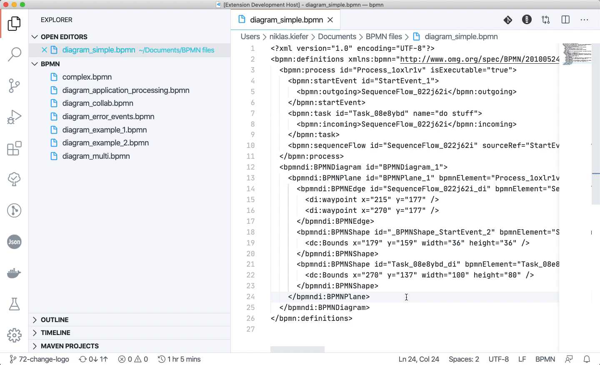

# vs-code-bpmn-io

  [](https://travis-ci.org/bpmn-io/vs-code-bpmn-io)

VS Code Extension for Displaying and Editing BPMN 2.0 Files, based on [bpmn.io](https://bpmn.io/).

## Features

* [x] Preview BPMN 2.0 files in VS Code
* [x] Open BPMN 2.0 in a Modeler to make changes to your diagrams
* [x] Save changes to your local file



## How to get it

Type `vs-code-bpmn-io` in the Extensions section and directly install it. You can also download it in the [Visual Studio Code Marketplace](https://marketplace.visualstudio.com/items?itemName=bpmn-io.vs-code-bpmn-io) or [setup it locally](#development-setup).


## Development Setup

First step, clone this project to your local machine.

```sh
$ git clone https://github.com/bpmn-io/vs-code-bpmn-io.git
$ cd ./vs-code-bpmn-io
$ npm install
$ code .
```

Press `F5` to load and debug the extension in a new VS Code instance.

To execute the test suite simply use

```bash
npm run test
```

The extension integration tests can also be executed from VS Code itself, simple choose the *Extension Tests* in the Debug mode.

## Go further

* Get a [Quickstart](./docs/DEVELOPMENT_QUICKSTART.md) on how to develop VS Code extensions
* Learn how to [release a new version](./docs/RELEASING.md)

## License

MIT

Contains parts ([bpmn-js](https://github.com/bpmn-io/bpmn-js)) released under the [bpmn.io license](http://bpmn.io/license).
